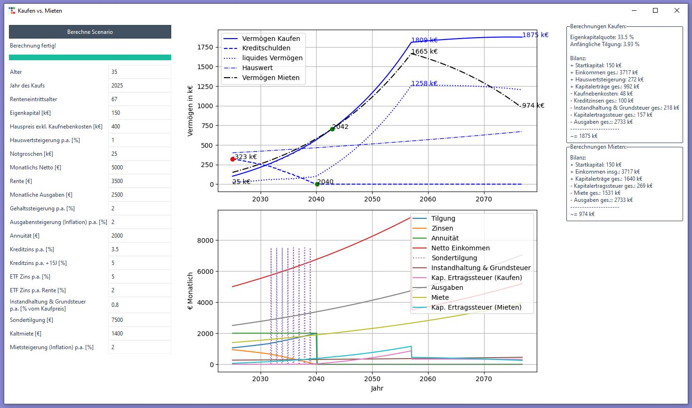

# Buying vs. Renting Calculator

A simple python-based calculator comparing buying and renting scenarios. Put in your values, press the calculation button and check your results. Labels are kept in german language for self-use reasons :)

## Demo Image


## Use Cases:
- Assess the feasibility of financing a property
- Assess whether purchasing a property is worthwhile compared to a rental scenario

## Setup
Run the following command to install dependencies.
```bash
pip install -r requirements.txt
```

## Advanced Use
There are some constant definitions in the `get_defaults` function, which you can only change in the code. Also, you can change the default values to avoid re-entering all your values.

## Note
No guarantee of the accuracy of all calculations
